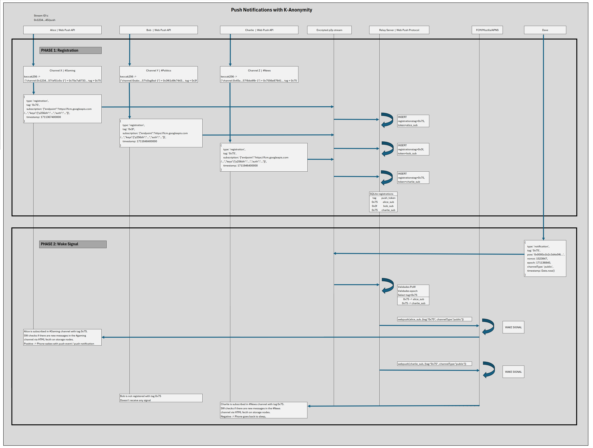

# 🕊️ Pombo Relay

Decentralized push notification relay for Pombo. Anyone can run their own relay!

## What is this?

The Pombo Relay is a server that:
1. **Listens** to the Streamr network (P2P) for "wake" signals
2. **Validates** Proof-of-Work (anti-spam)
3. **Delivers** push notifications via Web Push (Google FCM / Apple APNs) — and, optionally, native FCM for the Android app

## Quick Start

```bash
# 1. Enter the folder
cd pombo-relay

# 2. Install dependencies
npm install

# 3. Generate keys (creates the .env file)
npm run generate-keys

# 4. Run the relay
npm start
```

## Configuration (.env)

| Variable | Required | Purpose |
|---|---|---|
| `RELAY_PRIVATE_KEY` | yes | The relay's Streamr identity — a dedicated Ethereum private key (never reuse a personal wallet) |
| `VAPID_PUBLIC_KEY` / `VAPID_PRIVATE_KEY` | yes | Web Push (VAPID) keypair |
| `VAPID_EMAIL` | no | Contact email included in push requests |
| `POW_DIFFICULTY` | no | Proof-of-Work requirement for wake signals (default `4` = hash starts with `0000`) |
| `PUSH_STREAM_ID` | no | Streamr stream to listen on. The code default is a placeholder: with it the relay starts cleanly, listens to an empty stream, and never delivers anything — set it to the live Pombo push stream |
| `ADMIN_PORT` | no | Admin API port (default `8000`; set `0` to disable the admin API entirely) |
| `FCM_SERVICE_ACCOUNT` | no | Path to (or inline JSON of) a Firebase service-account key. Enables native FCM push for the Android app. Without it, the relay serves Web Push clients exactly as before and rejects native registrations. **This key is a secret — keep it outside the repo folder and never commit it** |

VAPID keys are the relay's identity to browsers: if you rotate them, every device must re-register for push. Back up your `.env` and `data/tokens.db`.

## How it works



The diagram covers the two phases: **registration** (devices register their push subscription under a 1-byte channel tag — tags deliberately collide across channels for K-anonymity) and **wake signal** (the relay validates PoW, looks up the tag and fans out to every matching device; each client checks the storage nodes and decides locally whether there is anything to show).

## Testing

```bash
# Check that the relay is working
npm test
```

## Administration

The relay ships with an admin HTTP API (port `ADMIN_PORT`) and an offline CLI (`admin-cli.js`). See [ADMIN_COMMANDS.md](ADMIN_COMMANDS.md).

⚠️ The admin API is unauthenticated and binds to all interfaces. Firewall the port to localhost, or set `ADMIN_PORT=0` and use the CLI instead.

## Running in the background

With PM2 (recommended):

```bash
npm install -g pm2
pm2 start index.js --name pombo-relay
pm2 save
pm2 startup
```

## A note on Android delivery

Even at maximum priority, Android may delay push delivery by minutes when the device is idle — Doze Mode, Adaptive Battery and Battery Saver are OS-level restrictions that no push service can override. The relay already does everything possible on the server side (`urgency: high`, 24h TTL, collapse keys, and data-only native FCM for the Android app). Delays beyond that are an Android limitation, not a relay problem.

## Requirements

- **Node.js** 18+
- **RAM** ~50–100 MB
- **Disk** ~100 MB (SQLite is embedded — no database server)
- **Network** stable internet connection

## Security

- The relay **cannot see** message contents
- The relay **does not know** the sender's IP
- Push tokens are stored locally (SQLite)

## License

MIT
